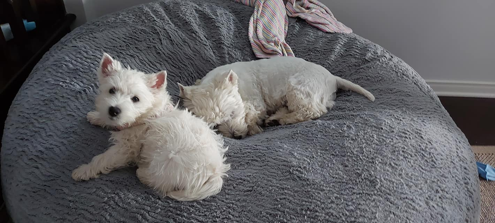

# Note 1
Say B

## This is a good second heading note
Say ah

### Now we have a third level hading note

Which note do you like best

#### Can we go further with a forth level note?
Yes, yes we can.

##### And a fifth? 
Yupi

###### Sixth?
wow

I just **love** how many headings we can do 
Really __love__ it! 
But then if I _love_ it, its italic!

*It is also italic like this*

But this is ***both***

1) Say one
2) say two

But perhaps, we can do some bullet

* hi
* hello

```
ohhhhhhhhhh
```

Picture can be done too!


[click here](https://images.unsplash.com/photo-1781458378182-0d946f4988cb?q=80&w=685&auto=format&fit=crop&ixlib=rb-4.1.0&ixid=M3wxMjA3fDB8MHxwaG90by1wYWdlfHx8fGVufDB8fHx8fA%3D%3D)

